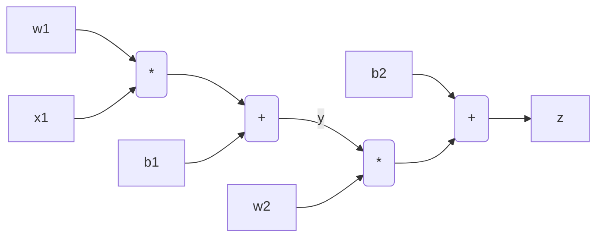
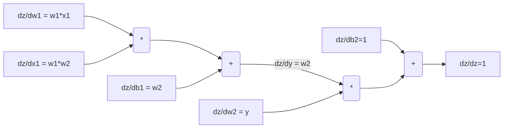
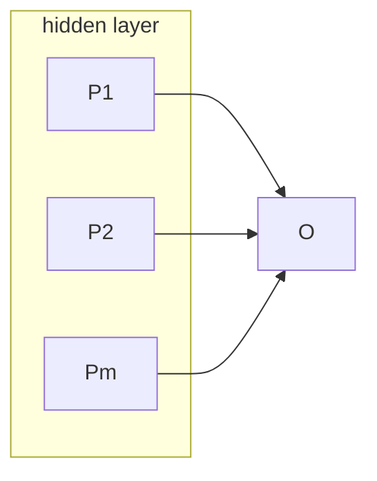
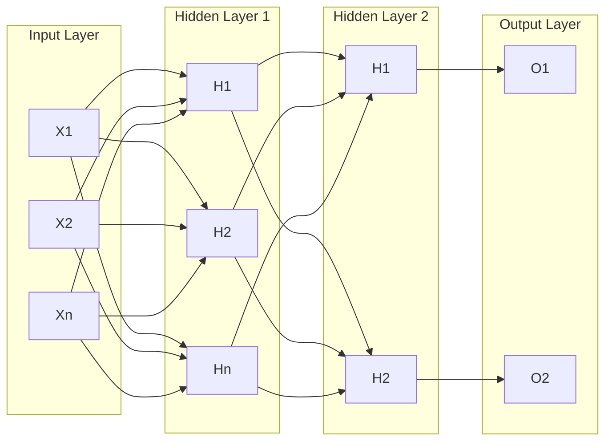

# autograd

It is a small Python implementation of back-propagation in a fully connected neural network. The implementation of `autograd` is based on the following observations and illustrations:

- #### Calculation of gradient automatically by using back propagation
The gradient of loss function with respect to the weights of last layers are calculated and back propagated through the intermediate and first layers using chain rule. Given the following simple relations (1):

$y=w_1x_1+b_1$
$z=w_2y+b_2$

The derivatives $dz/dw_2$ , $dz/db_2$, $dz/dw_1$, and $dz/db_1$ are calculated as following:

$dz/dw_2 = y$
$dz/db_2 = 1$
$dz/dy = w_2$
$dz/dw_1 = dz/dy *  dy/dw_1 = w_2x_1$ 
$dz/db_1 = dz/dy *  dy/db_1 = w_2$
$dz/dx_1 = dz/dy *  dy/dx_1 = w_2 w_1$ 

The flowchart below illustrates the relations (1):

There is a very helpful observation that the addition forwards the same derivative, and that the multiplication forwards the multiplication of the derivative with the other branch. This simplifies the implementation of back-propagation.

- #### Multi layer perceptron (MLP)

A perceptron is a mathematical expression that squashes the weighted sum of inputs to the range [-1, 1], which has $n$ inputs but only one output.

A hidden layer consists of $m$ perceptron each of which has a $n$ inputs. As a result a neural hidden layer has $n*m$ dimensions:

A multi layer perceptron consists of several layers, which are fully connected:

- #### Learning weights by gradient decent 

