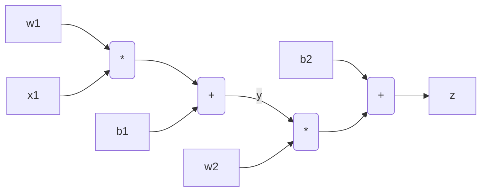

# autograd

It is a small python implementation of back propagation into a fully connected layers. It consists of

- #### Calculation of gradient automatically through back propagation
The gradient of loss function with respect to the weights of last layers are calculated and back propagated through the intermediate and first layers using chain rule. Given the following simple relations:

$y=w_1x_1+b_1$
$z=w_2y+b_2$

The derivatives $dz/dw_2$ , $dz/db_2$, $dz/dw_1$, and $dz/db_1$ are calculated as following:

$dz/dw_2 = y$
$dz/db_2 = 1$
$dz/dy = w_2$
$dz/dw_1 = dz/dy *  dy/dw_1 = w_2x_1$ 
$dz/db_1 = dz/dy *  dy/db_1 = w_2$
$dz/dx_1 = dz/dy *  dy/dx_1 = w_2 w_1$ 

- #### Multi layer perceptron (MLP)
- #### Learning weights by gradient decent 

