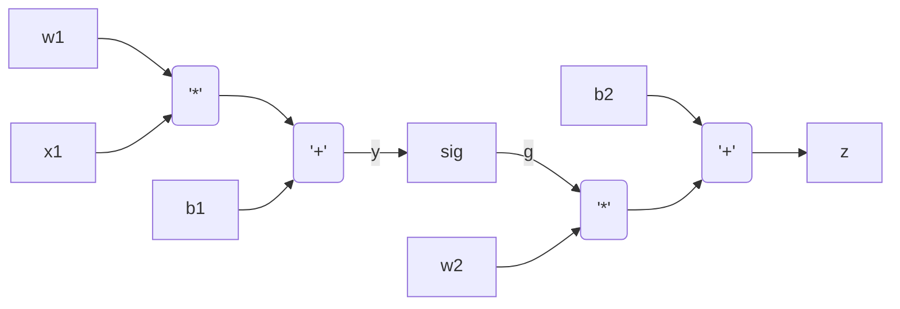
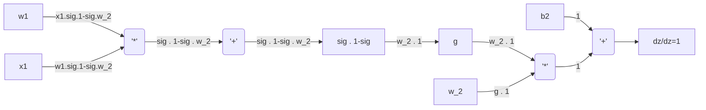
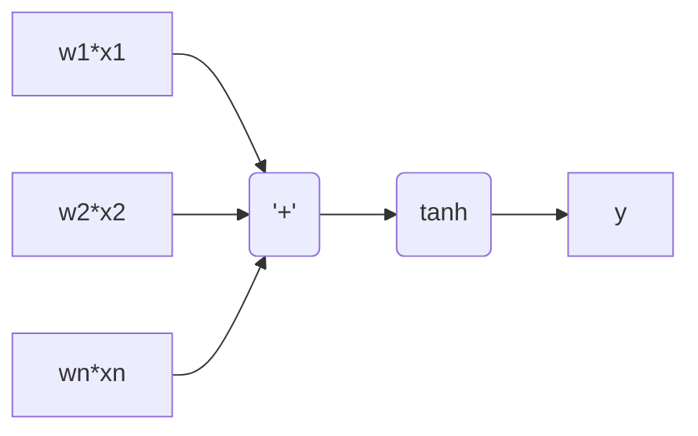
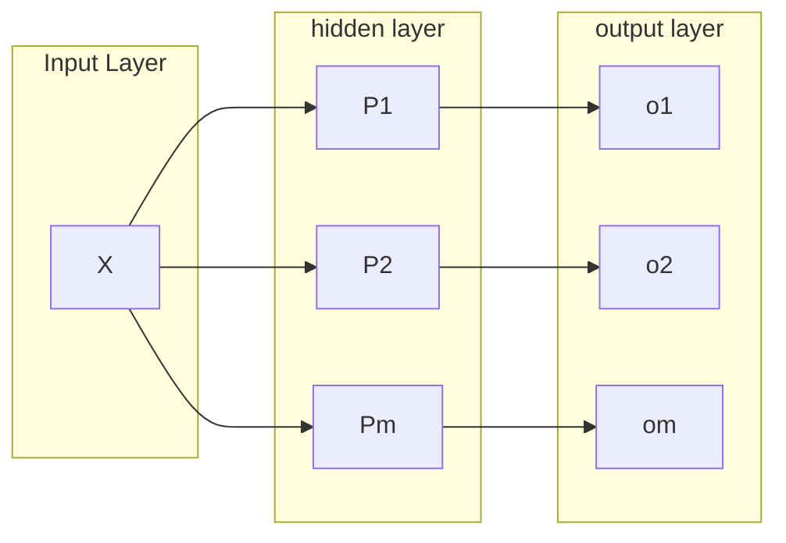
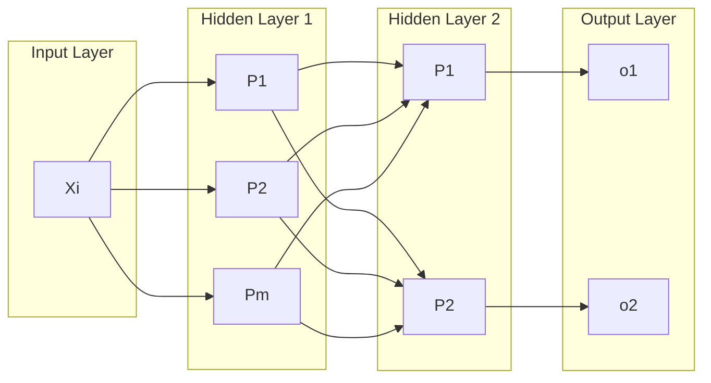

# autograd

It is a small Python implementation of a binary classifier. for which multiple layer perceptron, back-propagation and optimization are implemented from scratch. The implementation of `autograd` is broken down to the following sections:

- ### Calculation of gradient automatically by using back propagation
The gradient of loss function with respect to the weights of last layers are calculated and back propagated through the intermediate and first layers using chain rule. Given the following simple relations (1), which a very simple neural network:

$$
y=w_1x_1+b_1
$$

$$
g=sig(y)
$$

$$
z=w_2g+b_2
$$

The derivatives $dz/dw_2$ , $dz/db_2$, $dz/dw_1$, and $dz/db_1$ are calculated as following:

$$
\frac{dz}{dw_2} = \sigma(y) 
$$

$$
\frac{dz}{db_2} = 1
$$

$$
\frac{dz}{dg} = w_2
$$

$$
\frac{dz}{dy} = \frac{dz}{dg} \cdot \frac{dg}{dy} = w_2 \cdot \sigma(y) \cdot (1 - \sigma(y))
$$

$$
\frac{dz}{dw_1} = \frac{dz}{dg} \cdot \frac{dg}{dy} \cdot \frac{dy}{dw_1} = w_2 \cdot \sigma(y) \cdot (1 - \sigma(y)) \cdot x_1
$$

$$
\frac{dz}{db_1} = \frac{dz}{dg} \cdot \frac{dg}{dy} \cdot \frac{dy}{db_1} = w_2 \cdot \sigma(y) \cdot (1 - \sigma(y))
$$

### Notation Guide
- $\sigma(y)$: Sigmoid activation function
- $w_n$: Weight parameter
- $b_n$: Bias parameter
- $x_n$: Input feature
- $y$: Intermediate layer outpu
- $g$: Intermediate layer outpu

The flowchart below illustrates the relations (1):

In backpropagation, two key observations make the process easier to understand and implement:

1. **Addition Nodes**: When calculating derivatives, an addition node simply passes the derivative it receives from its parent node directly to both its child nodes.

2. **Multiplication Nodes**: For multiplication nodes, the derivative passed to each child node is the product of the derivative received from the parent node and the value of the other child node.

These simple rules significantly simplify how backpropagation is implemented in neural networks:

- ### Multi layer perceptron (MLP)

A perceptron is a mathematical expression that squashes the weighted sum of inputs $X$ to the range [-1, 1], which has $n$ inputs but only one output.

A hidden layer consists of $m$ perceptron each of which has a $n$ inputs but only one output. As a result a neural hidden layer has $n*m$ dimensions:

A multi layer perceptron (MLP) consists of several layers, which are fully connected. The output of MLP is a function of data point $X_i$ with $n$ dimensions and weights $W$:

$$
\hat{Y}_i = f(X_i, W)
$$

- ### Learning weights by gradient decent 

Given $N$ number of data points $X_i$, $N$ number of measurements $Y_i$, and a MLP, that is abstracted as \( f(X_i, W) \), the following loss function is defined:

$$ 
\text{L} = \frac{1}{N}\sum_{i=1}^{n} (Y_i - \hat{Y}_i)^2
$$

Where:
- $n$ is the number of data points with $m$ dimensions
- $Y_i$ is the observation for the $i$-th data point.
- $\hat{Y}_i$ is the prediction for the $i$-th data point, which can be assumed that is the output of a multi layer perceptron, $\hat{Y}_i = f(X_i, W)$. 

In the loss function $L$, the data points $X_i$ vary but the weights $W$ are constant. The weights should be tuned in a way that the predictions $\hat{Y}_i$ are close enough to $Y_i$ so that $L$ goes to zero. The weights are iteratively tuned using gradient descent:

$$ 
W_{k+1} = W_{k} - \alpha \nabla_{W} L(W_{k})
$$

- $W$ represents the parameters (weights) of the model.
- $\alpha$ is the learning rate, a positive scalar that controls the step size.
- $\nabla_{W} L(W)$ is the gradient of the function $f$ with respect to $W$ at $W_k$ .

The gradient of loss function $L$ with respect to weights $W$ is calculated using the back-propagation explained above. The number of data points could be too many leading to a very big loss function and consequently too much sequential computation at the time of gradient computation. Therefore the data points are split in batches so that they are independently substituted in loss function and the corresponding gradient is calculated separately. This makes loss function smaller and enables parallel tunning of weights.